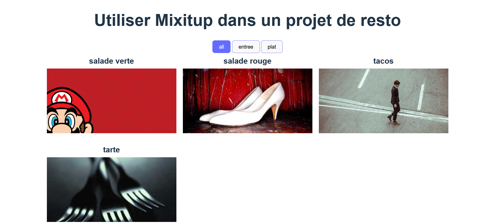
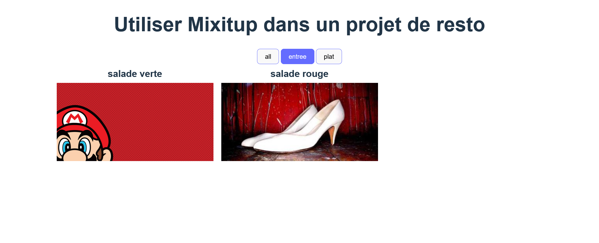

# j'ai installé le composant react-mixitup

## commande 

```
npm install react-mixitup
```

## guide 

<https://react-mixitup.ricsam.dev/docs/guide>

## rendu

### btn app



### btn entree



## Dans le composant Menu.jsx 

1. créer une variable menu contenant l'ensemble des données à afficher dans le composant mixitup, attention il faut un id différent pour que élément du tableau

```jsx
const menu = [{},{},{},{}] 
```

2. transformer la variable `menu` en state `plat`  

```jsx
const [plat, setMenu] = useState(menu)  
```
 
3. effet sur le bouton pour montrer sur quelle categorie est actuellement activée

```js
const [ currentValue , setCurrentValue ] = useState("all") 
```

4. tableau qui contient uniquement les id des éléments du tableau :

```js
const ids = plat.map(plat => plat.id) 
//  [1,2,3,4]
```

5. créer un dictionnaire depuis la variable `menu` :

```js
const dictionnaire = Object.fromEntries(menu.map(plat => [plat.id, plat]));
// { 1: {…}, 2: {…}, 3: {…}, 4: {…} }
```

6. Utiliser le composant  :

```jsx 
<ReactMixitup 
    keys={ids}
    renderCell={  
        function(key, style, ref){
            const plat = dictionnaire[key]
            return (
                <div>
                    <p>{plat.nom}</p>
                    
                </div>
            )
        }
    }
    renderWrapper={}
    dynamicDirection="horizontal"
    transitionDuration={300}
/>
```

7. faire boucle les éléments du mixitup via des click  
    il faut donner au state `plat` via  `setPlat()` un tableau qui contient uniquement les éléments à filtrer dans `onClick`